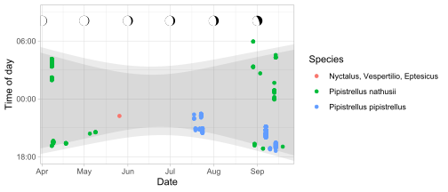

# gghourglass 

<!-- badges: start -->

[](https://github.com/pepijn-devries/gghourglass/actions/workflows/R-CMD-check.yaml)

[](https://CRAN.R-project.org/package=gghourglass)
[](https://cran.r-project.org/web/checks/check_results_gghourglass.html)
[](https://pepijn-devries.r-universe.dev/gghourglass)
[](https://app.codecov.io/gh/pepijn-devries/gghourglass?branch=master)
<!-- badges: end -->

Splits observations with datetime stamps into date and time of day
components, then displays them in a scatter plot using grammar of
graphics ([ggplot2](https://ggplot2.tidyverse.org/)). Plots can also be
decorated with coloured ribbons indicating night time. This is helpful
for visualising data that are associated with the solar cycle, such as
bat activity.

## Installation

Install CRAN release:

``` r
install.packages("gghourglass")
```

Install latest developmental version from R-Universe:

``` r
install.packages("gghourglass", repos = c('https://pepijn-devries.r-universe.dev', 'https://cloud.r-project.org'))
```

## Example

``` r
## load required namespaces
library(ggplot2)
library(lubridate)
library(gghourglass)

## get example data
data(bats)

## subset example date to the year 2018
bats_sub <- subset(bats, format(RECDATETIME, "%Y") == "2018")

## retrieve monitoring location
lon <- attr(bats, "monitoring")$longitude[1]
lat <- attr(bats, "monitoring")$latitude[1]

## plot the data
ggplot(bats_sub, aes(x = RECDATETIME, col = SPECDESCSCI)) +
  
  ## annotate sunset until sunrise
  annotate_daylight(lon, lat, c("sunset", "sunrise")) +
  
  ## annotate dusk until dawn
  annotate_daylight(lon, lat, c("dusk", "dawn")) +
  
  ## add hourglass geometry to plot
  geom_hourglass() +
  
  ## add lunar phase annotation
  annotate_lunarphase(NULL, lon, lat, radius = grid::unit(2, "mm")) +

  ## extend y-scales to fit lunar phase annotation
  scale_y_datetime(limits = as_datetime(c(period(-6, "hour"),
                                          period(+9, "hour")))) +
  
  ## add informative labels
  labs(x = "Date", y = "Time of day", col = "Species")
```

<!-- -->

## Code of Conduct

Please note that the gghourglass project is released with a [Contributor
Code of
Conduct](https://pepijn-devries.github.io/gghourglass/CODE_OF_CONDUCT.html).
By contributing to this project, you agree to abide by its terms.
